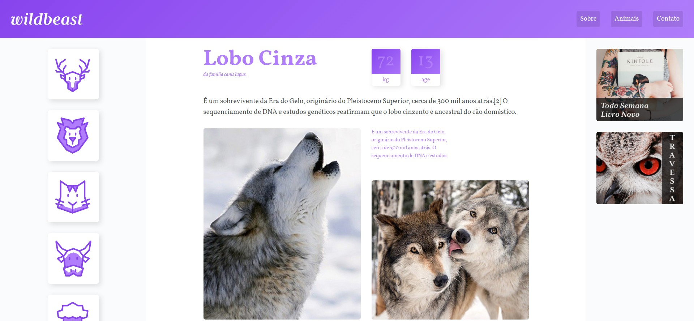

<h1 align="center">
  
</h1>

<h3 align="center">
  Curso realizado na origamid - Edu Souza o/
</h3>

<blockquote align="center">“Você sempre sabe quando não fez o suficiente, mas você nunca sabe quando fez demais.
- Charley Pell”</blockquote>

<h4 align="center">
  Repositório - CSS Grid Layout
</h4>

 

  &nbsp;
  &nbsp;
  

  <a href="#rocket-Sobre-o-curso">Sobre o curso</a>&nbsp; &nbsp; |&nbsp; &nbsp; 
  <a href="#postbox-Entrega"">Entrega</a>&nbsp; &nbsp; |&nbsp; &nbsp; 
  <a href="#unlock-Licença">Licença</a>

## :rocket: Sobre o curso

#### CSS Grid Layout

No curso de CSS Grid Layout você irá aprender como criar um layout responsivo no CSS utilizando as novas propriedades do CSS Grid Layout. Com ele você pode criar layouts complexos utilizando e ainda manter a marcação do HTML limpa.

O CSS Grid Layout é uma nova especificação do CSS e ela veio para resolver praticamente todos os problemas de posicionamento na tela que existem. No curso eu inicio pelos fundamentos e depois vamos para a prática criando um projeto real do zero.

#### Screenshots:

   &nbsp; &nbsp; 
  

## :postbox: Entrega

#### Concluido :clipboard:

Acesse o deploy do projeto [aqui](https://edusouza-programmer.github.io/css_grid_layout-origamid/).

# 
## :unlock: Licença

Este projeto está licenciado sob a Licença MIT - consulte [LICENSE](https://opensource.org/licenses/MIT) para maiores detalhes.
